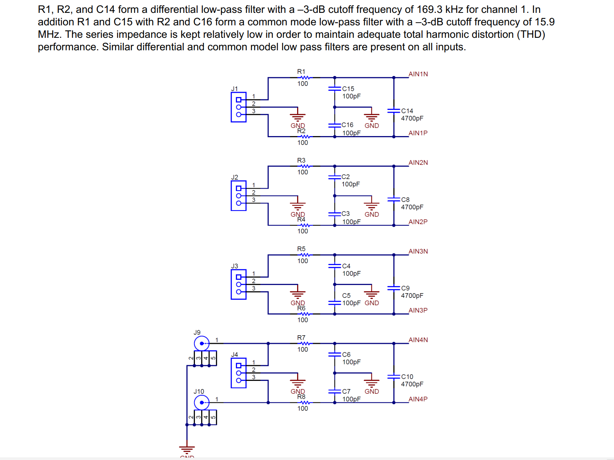
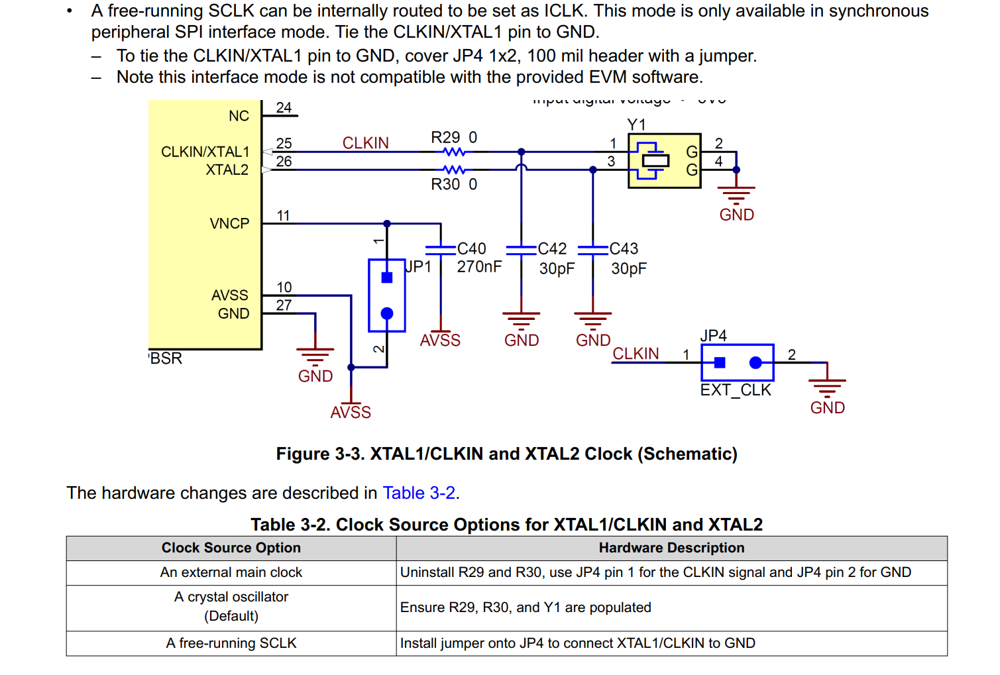
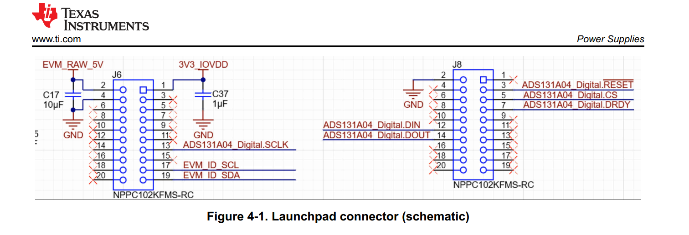
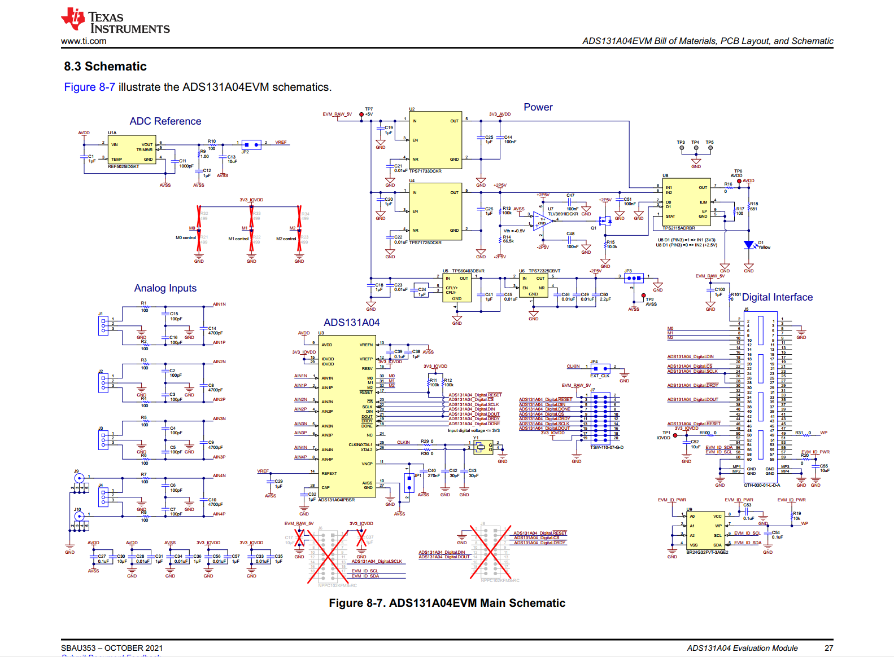
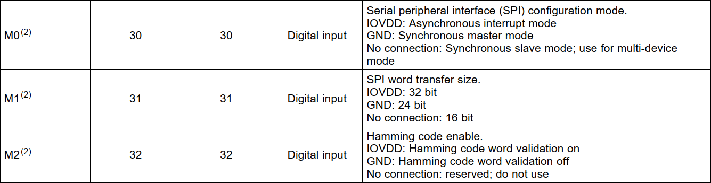

# ADS131A04

### 1: 推荐模拟输入端设计

### 2：推荐晶振设计

### 3：

### 4：电源芯片

|      型号      | 电压  | 类型 |
| :------------: | :---: | :--: |
|  TPS71733DCKR  | 3.3V  | LDO  |
|  TPS60403DBVR  |       |      |
|  TPS72325DBVT  | -2.5V | LDO  |
|  REF5025IDGKT  |       |      |
| ADS131A04IPBSR |       |      |
|  TPS71725DCKR  |       |      |
|  TLV3691IDCKR  |       |      |
|  TPS2115ADRBR  |       |      |
|                |       |      |

### 5：官方原理图demo

#### 6：模式配置

| 模式引脚 |  模式功能   |     IOVDD      |      GND       |     NC     |
| :------: | :---------: | :------------: | :------------: | :--------: |
|    M0    | SPI配置模式 |  异步中断模式  |   同步主模式   | 同步从模式 |
|    M1    | SPI传输大小 |     32bit      |     24bit      |   16bit    |
|    M2    |   汉明码    | 汉明码验证开启 | 汉明码验证关闭 |   不使用   |

